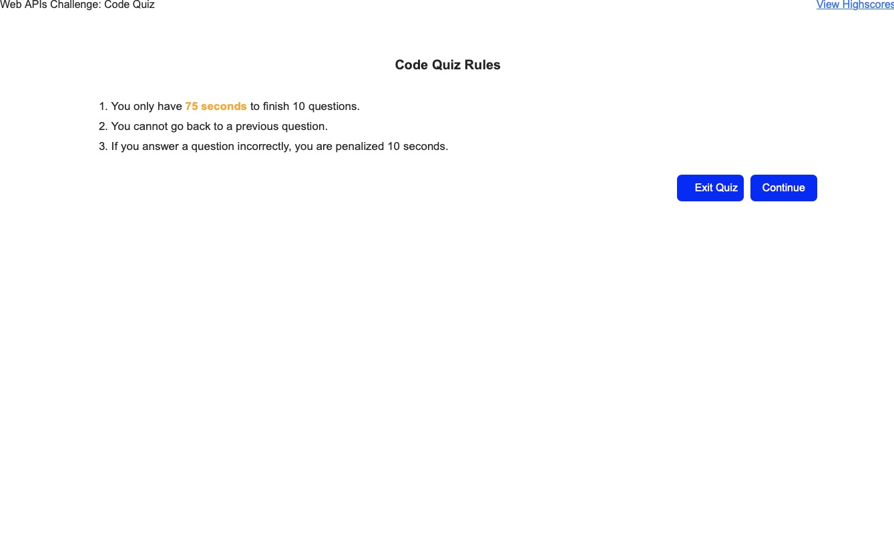
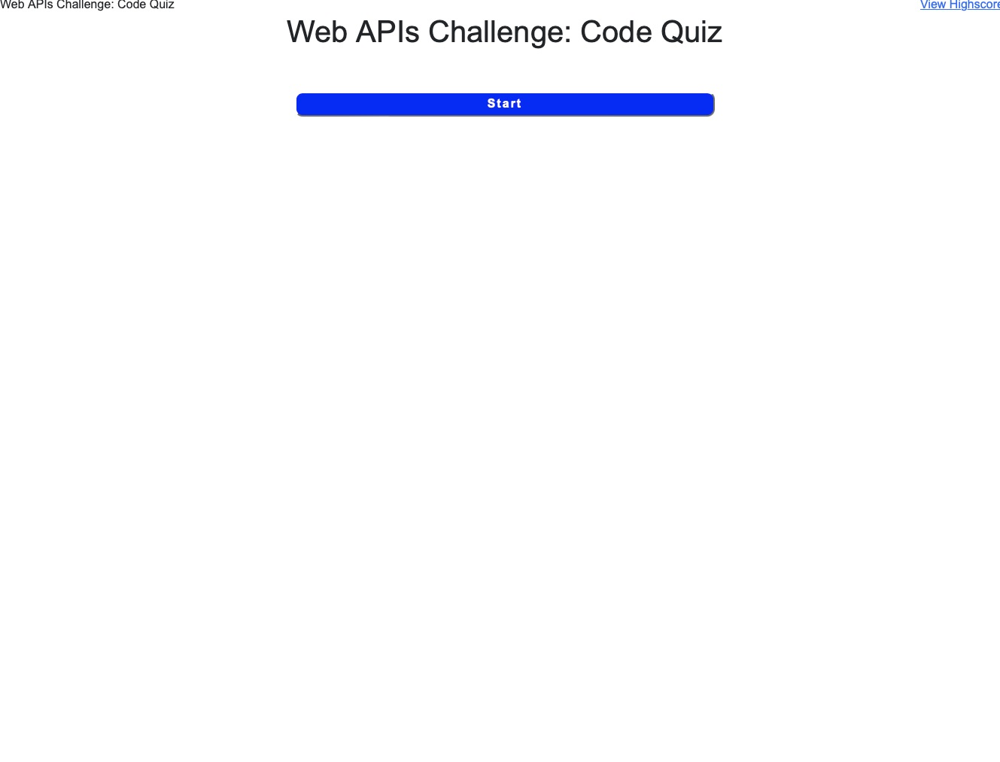
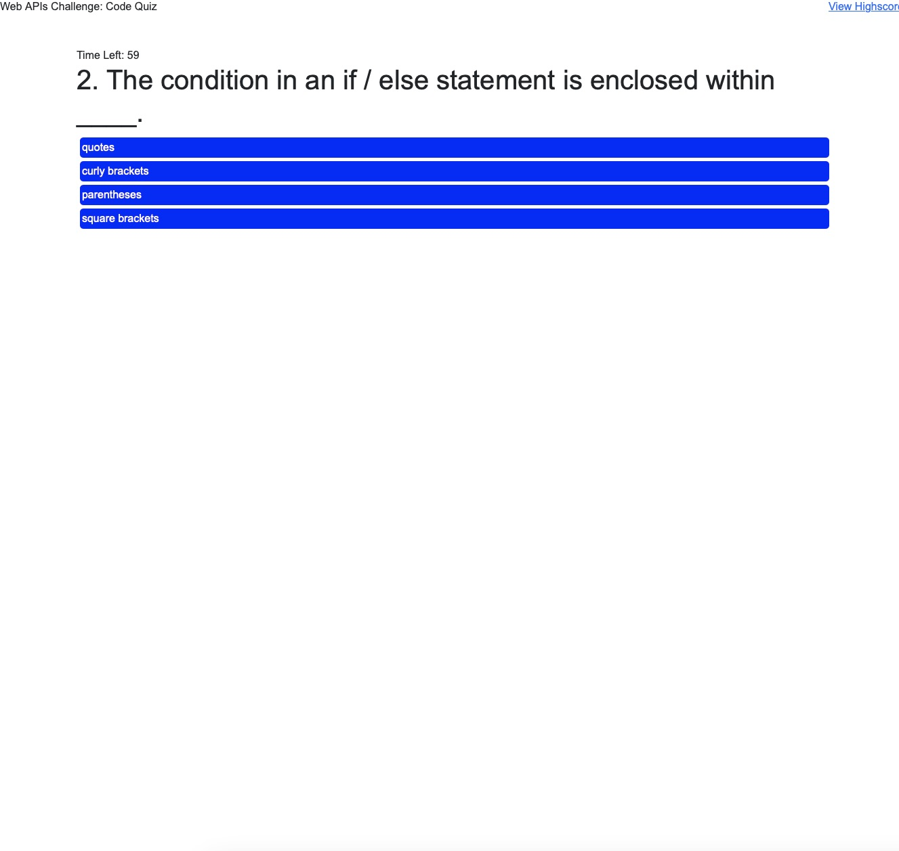

# Web API Challenge: Code Quiz
  
  ## Table of Contents
  * [Description](#Description)
  * [Installation](#Installation)
  * [Usage](#Usage)
  * [Licenses](#License)
 
  ## Description
  A typical coding assessment consists of interactive coding challenges and multiple-choice questions.
  ## Installation
  Clone the repository locally and double click index.html or click on the link below in the usage section

  ## Usage
  The following images show the web application's appearance and functionality:
  

  

  

  To visit please click on link [link](https://vsoto7697.github.io/VsotoJSquiz/)
  
  ## Questions
  Have questions about this project?  
  GitHub: https://github.com/Vsoto7697  
  Email: Vsoto7697@gmail.com
